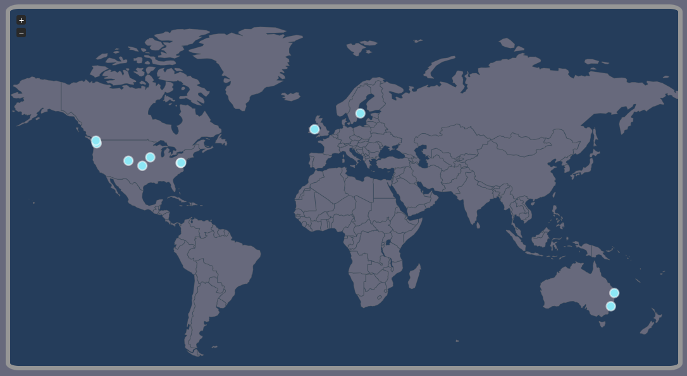
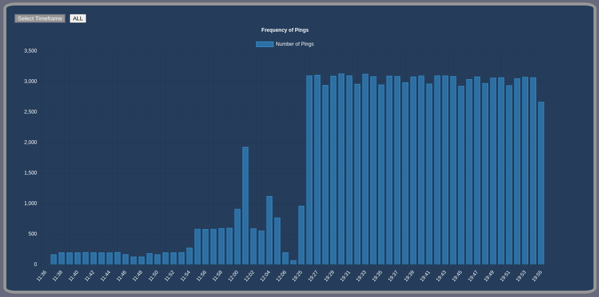
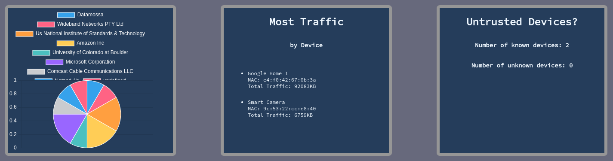

## 49X-Smarthome-Privacy


Install postgresql and start a cluster-this will be different depending on your operating system. Consult the documentation at https://www.postgresql.org/download.

Once you have a cluster up and running, create a new user with enough rights to create, read from, and write to tables. Put the username and password for this postgres user
into the config file (config/config.cfg). Additionally, make sure the port is accurate in the database connection string in db/databaseBursts.py.

For the python dependancies, create a new python environment, run it, then install the packages with the commands below. 

```
python3 -m venv <python-env-filename>

source <python-env-filename>/bin/activate

pip install -r requirements.txt
```

Now, you should be able to run scripts/reset-database.py to set up the postgres database according to db/schema.sql.
For additional help and documentation, you can also consult the original Aretha repository at:
https://github.com/OxfordHCC/Aretha

Many thanks to them.


To start the dashboard, you need to have index.html hosted on a local server.
There a many ways to do this, including using a vs code extension called live server.

The node.js server needs to be running so that queries can be sent to the postgres database.
To start the server, navigate a terminal window to the Smarthome folder, and type 'node app.js' into the command line.

Depending on what web browser you are using, you may need to allow CORS to send XMLHttpRequests. They are labeled as unsafe, but
this needs to be disabeled to properly query from the databse.


Once the dashboard is running, you will see the list of devices on the left side of the screen if there are any. Otherwise,
you will only see the 'All' button. Selecting any of these options will populate the widgets with data.








As stated before, app.js is the node server application that is used to query the database for the dashboard webpage. This must be running for any of the data to be queried and displayed. Broadly speaking, it takes an XMLHttp request and parses the arguments as a database query, queries the database and returns the data.

Also in the root directory is the index.html. This is the only html page currently in the project. There are a couple of scripts at the bottom of index.html that use setInterval() to update the device list every 2 seconds.

Next, in scripts we have map.js, this file declares our jsVectormap instance. The map will contain markers that are populated by other scripts. Otherwise in this file you can change certain styling aspects. View the JS Vectormap documentation to learn more about how markers and interractivity works.

mapScript.js starts with building, sending and returning the query for geodata based on the device name passed. It also has the logic to create map markers for the webpage.

updateWidgets.js is the next script, it is used to execute the various query scripts when a device name or the all devices button is hit on the left as well as make visible or invisble the widgets that need to be hidden.

editTitle.js does 2 main functions, first it actually queries for all the names and mac addresses of the devices to display. The second function is that it can update the names of devices on the network. It handles the logic for making the text box and edit buttons available as well as sending the query to change names.

freqGraph.js handles the frequency graph. It takes the time scale that is selected in the webpage and then generates a query for the data that is saved in that timeframe. The all button that is visible currently runs a query that organizes all data in the database by hh:mm, useful for working with test data but not a mess of data for a user.

mostTraffic.js is run once on refresh of the website. It updates the most traffic widget with information on which device on the network has transmitted the most data, measured in KB.


Links to packages used:

JS Vector map: https://jvm-docs.vercel.app/docs/introduction

Chart.js: https://www.chartjs.org/docs/latest/getting-started/installation.html

Postgres: https://node-postgres.com 
